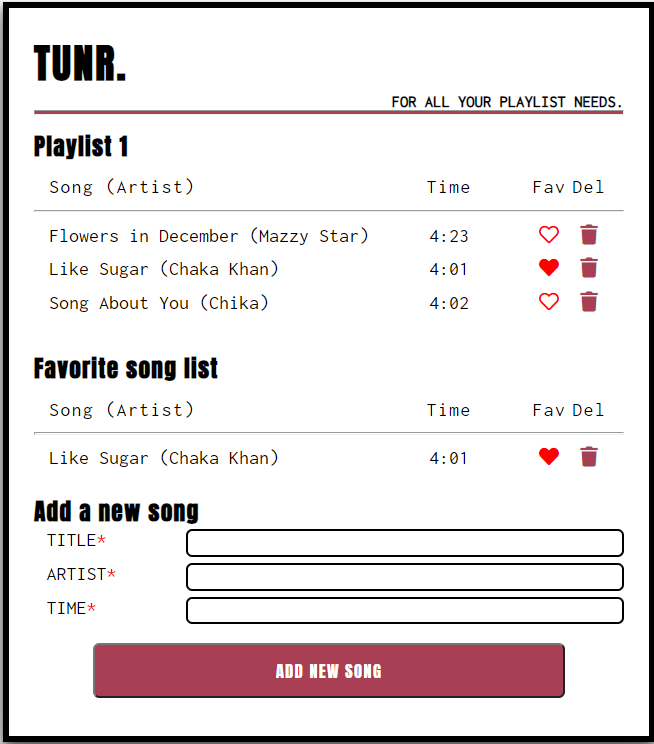

# READ ME

## About Project

TUNR Project is a SPA (Single Page Application) that displays the songs is a user's Playlist and allows to add / update and delete songs in the playlist. It also shows the favorite songs in the playlist.

## User Stories

1. User should be able add a song to the playlist
2. User should be able to list the songs in his playlist
3. User should be able to delete a song from the playlist
4. User should be able to mark or un-mark a song as favorite
5. User should be able to view the list of favorite songs

## The project has 2 parts -

1. [Frontend Repo](https://github.com/sampreet-chawla/tunr-react-frontend) - This repo is the frontend repo, deployed in [Netlify](https://tunr-react-frontend.netlify.app/). It was built in React with create-react-app.
2. [Backend repo](https://github.com/sampreet-chawla/tunr-rails-backend) has the backend code deployed in [Netlify](https://tunr-rails-backend.herokuapp.com/songs). It was built with Ruby on Rails, and uses ActiveRecord to work with PostgreSQL database.

### Webpage Snapshot

### Libraries used in Frontend

- Axios

### Technical Challenges

Sometimes the backend works well but the frontend has issues accessing the backend and gives 400 / 500 series of Http Status code errors. These can be noticed in the Chrome Developers Tools in the network section. It the backend urls are working fine in Postman, then following could be the issues -

- CORS needs to be configured and need to made accessible to the frontend application
- Axios calls and its syntax needs to be checked as sometimes it does not raise any error, and the request data in body is not sent for POST / PUT requests.
- The data validations or data mismatch need to be checked, as sometimes they are silently ignored.

### Improvements

- Can work more on the styling
- Can attempt with multiple models with playlists and songs having many-to-many relationships. User authentication can also be added. An embedded song player can be added to listen to live songs. The UI can be customized accordingly.

#### Original Assignment Link

[Assignment Link](https://git.generalassemb.ly/Sampreet-Chawla/rails-mini-project)

# Getting Started with Create React App

This project was bootstrapped with [Create React App](https://github.com/facebook/create-react-app).

## Available Scripts

In the project directory, you can run:

### `yarn start`

Runs the app in the development mode.\
Open [http://localhost:3000](http://localhost:3000) to view it in the browser.

The page will reload if you make edits.\
You will also see any lint errors in the console.

### `yarn test`

Launches the test runner in the interactive watch mode.\
See the section about [running tests](https://facebook.github.io/create-react-app/docs/running-tests) for more information.

### `yarn build`

Builds the app for production to the `build` folder.\
It correctly bundles React in production mode and optimizes the build for the best performance.

The build is minified and the filenames include the hashes.\
Your app is ready to be deployed!

See the section about [deployment](https://facebook.github.io/create-react-app/docs/deployment) for more information.

### `yarn eject`

**Note: this is a one-way operation. Once you `eject`, you can’t go back!**

If you aren’t satisfied with the build tool and configuration choices, you can `eject` at any time. This command will remove the single build dependency from your project.

Instead, it will copy all the configuration files and the transitive dependencies (webpack, Babel, ESLint, etc) right into your project so you have full control over them. All of the commands except `eject` will still work, but they will point to the copied scripts so you can tweak them. At this point you’re on your own.

You don’t have to ever use `eject`. The curated feature set is suitable for small and middle deployments, and you shouldn’t feel obligated to use this feature. However we understand that this tool wouldn’t be useful if you couldn’t customize it when you are ready for it.

## Learn More

You can learn more in the [Create React App documentation](https://facebook.github.io/create-react-app/docs/getting-started).

To learn React, check out the [React documentation](https://reactjs.org/).

### Code Splitting

This section has moved here: [https://facebook.github.io/create-react-app/docs/code-splitting](https://facebook.github.io/create-react-app/docs/code-splitting)

### Analyzing the Bundle Size

This section has moved here: [https://facebook.github.io/create-react-app/docs/analyzing-the-bundle-size](https://facebook.github.io/create-react-app/docs/analyzing-the-bundle-size)

### Making a Progressive Web App

This section has moved here: [https://facebook.github.io/create-react-app/docs/making-a-progressive-web-app](https://facebook.github.io/create-react-app/docs/making-a-progressive-web-app)

### Advanced Configuration

This section has moved here: [https://facebook.github.io/create-react-app/docs/advanced-configuration](https://facebook.github.io/create-react-app/docs/advanced-configuration)

### Deployment

This section has moved here: [https://facebook.github.io/create-react-app/docs/deployment](https://facebook.github.io/create-react-app/docs/deployment)

### `yarn build` fails to minify

This section has moved here: [https://facebook.github.io/create-react-app/docs/troubleshooting#npm-run-build-fails-to-minify](https://facebook.github.io/create-react-app/docs/troubleshooting#npm-run-build-fails-to-minify)
